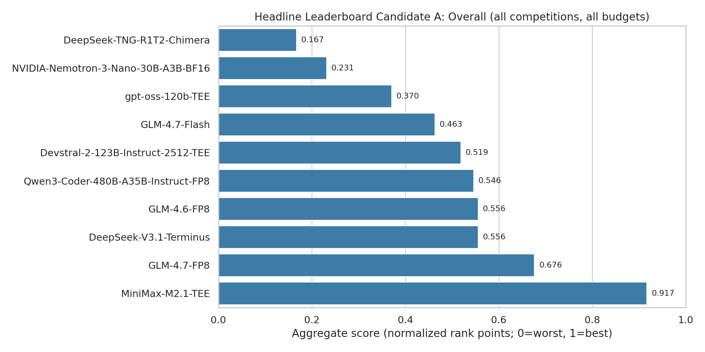
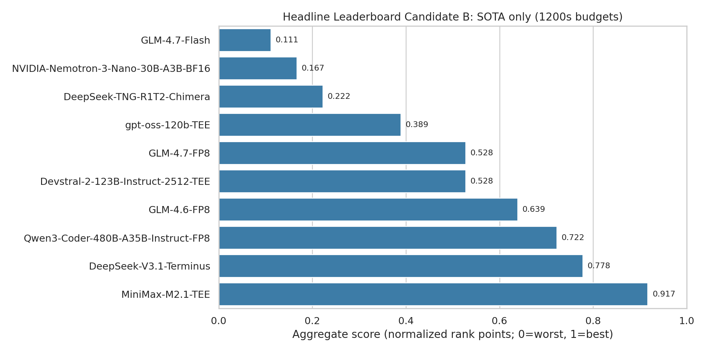

# Appendix: Leaderboard Robustness Variants (v1)

This appendix provides two alternative aggregations of the canonical 10-model leaderboard. They are not used as the primary plot, but serve as robustness checks.

## Variant A: Overall (all competitions, all budgets)

## Variant B: SOTA-only (1200s)

