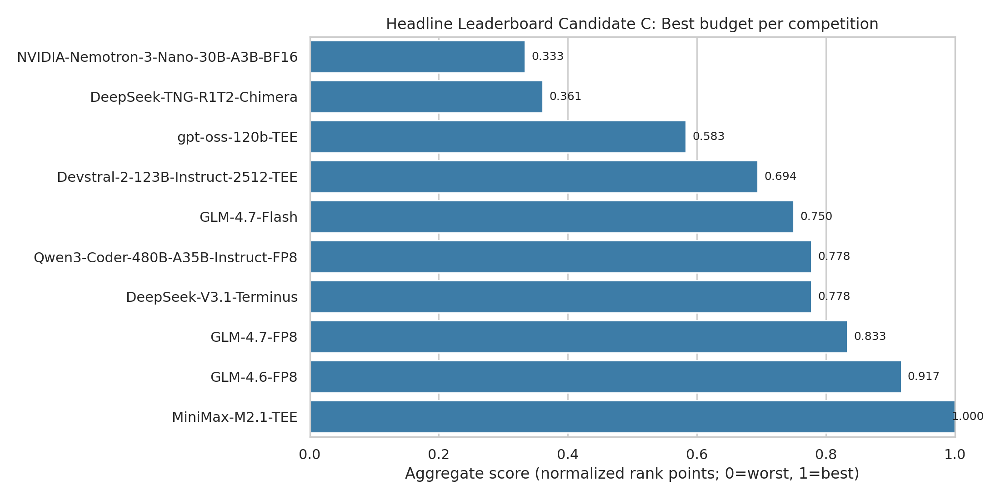
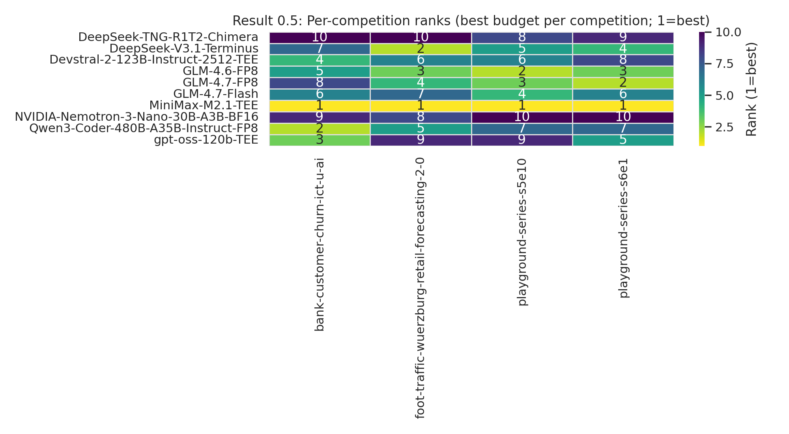
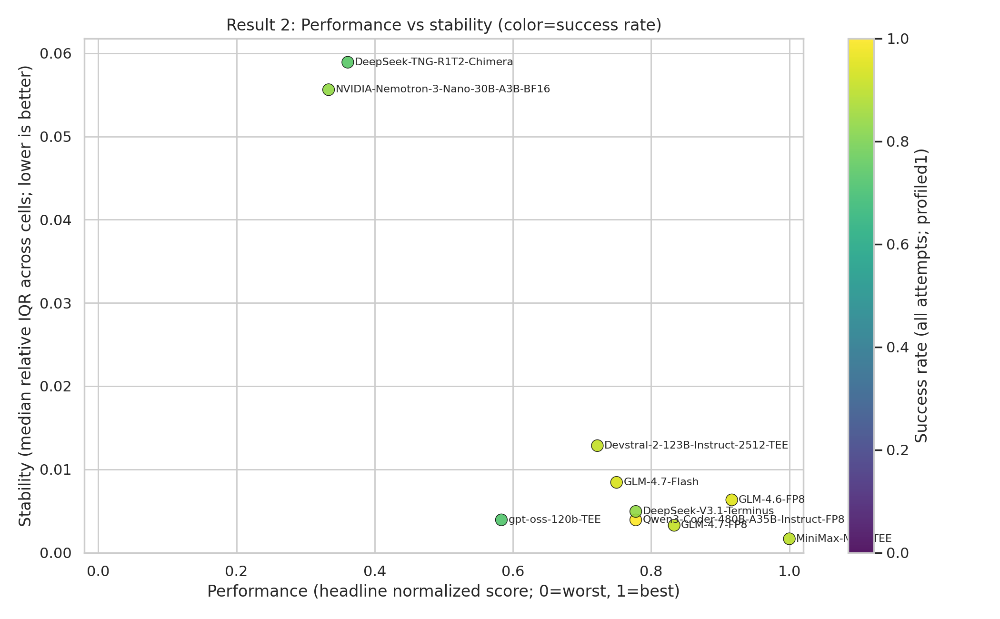
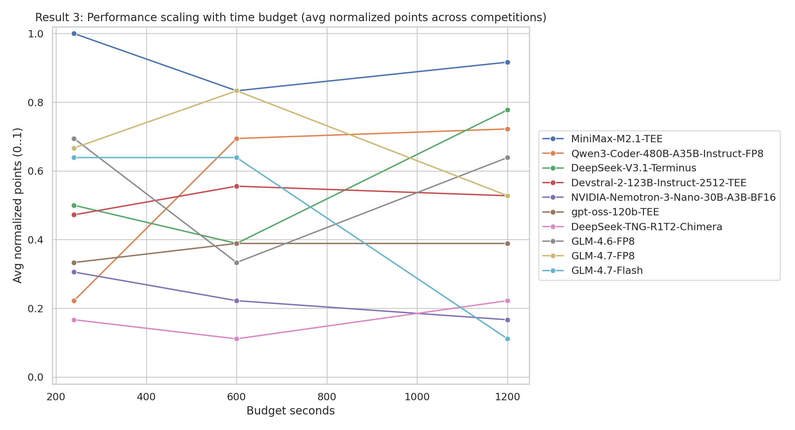
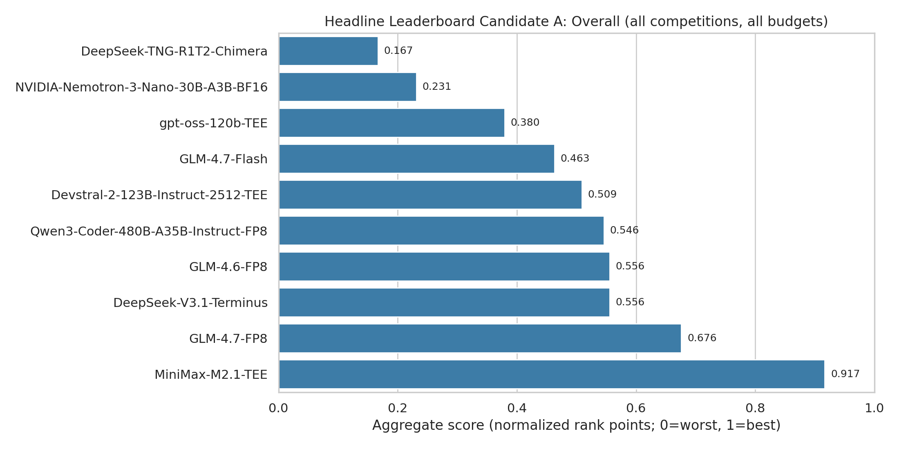
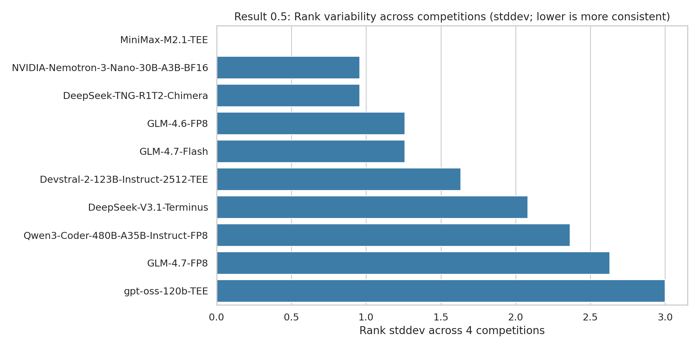

# TML-bench: Benchmark for Data Science Agents on Tabular ML Tasks

Mykola Pinchuk, PhD  
Independent Researcher  
San Jose, USA  
`pinchumkykola@gmail.com`

Date: 2026-02-14

## Abstract

Autonomous coding agents can produce strong tabular baselines quickly on Kaggle-style tasks. However, many agent benchmarks do not measure the full workflow under a strict, repeatable protocol. This paper introduces TML-bench, a tabular-only benchmark for evaluating data science agents using a single universal harness (Kilo Code). The benchmark enforces deterministic data preparation, strict submission validation, and private-holdout scoring outside the agent workspace. This paper reports results from a frozen, reproducible evidence base. Reporting is restricted to models that achieved complete five-run coverage across all evaluation cells.

## 1. Introduction

Tabular machine learning remains a common practical workload. The workflow includes data loading, feature preparation, model training, evaluation, iteration, and producing a correctly formatted submission artifact. Benchmarks that only test isolated coding tasks miss important failure modes and trade-offs.

This paper evaluates data science agents on a strict tabular benchmark with private-holdout scoring. The target is an auditable leaderboard built from repeatable runs. The benchmark reports distributions across runs rather than a single best attempt.

For practitioners, this framing matters for two reasons. First, a good agent must be reliable. Capability on a single lucky run is insufficient. Second, comparisons should remain meaningful when tasks use different metrics and when runs are time-bounded.

### 1.1 Contributions

This paper makes the following contributions:
- A strict benchmark protocol for Kaggle-style tabular tasks with deterministic preparation, strict submission validation, and private-holdout scoring.
- A reporting policy that emphasizes repeatability: fixed prompt strategy, fixed suite, and median-of-five aggregation with explicit coverage requirements.
- A reproducibility contract that allows results to be regenerated and audited from a small set of pinned inputs and scripts.
- Results and analysis that highlight performance, cross-competition consistency, reliability, and scaling with time budget.

## 2. Benchmark and protocol

### 2.1 Suite, profiles, and evaluation grid

This paper evaluates model-assisted tabular ML work over a four-competition suite and three time budgets (240s, 600s, 1200s). The 1200s configuration uses an XGBoost-focused prompt profile.

Reporting is restricted to models that reached complete five-run coverage across all `12` `(competition, profile)` cells. Under that rule, `10` models are included in the main tables.

### 2.2 Prompt strategy and aggregation rule

A fixed prompt family is used for all runs in this paper.

For each `(competition, model, profile)` cell, the reported value is the median of the earliest 5 successful runs ordered by `created_at`.

### 2.3 Evidence base and reproducibility contract

The evidence in this paper is derived from run databases that record outcomes for each run (status, score, runtime, and run configuration). A validation step confirms that all reported cells have the required five successful runs.

At freeze time, coverage checks report `sources_found=9/9`, `models_in_scope=10`, and `missing_cells=0`.

### 2.4 Agent harness (Kilo Code)

Each run is executed in a clean workspace managed by the Kilo Code harness. The harness provides the task files and instructions, enforces the time budget, and records execution metadata. A run is successful if it produces a valid submission file and the private-holdout scoring step completes.

### 2.5 Metrics and normalization

Each competition has a task-defined metric. This paper reports `score_raw` in the task’s native direction (for example, AUC where higher is better, and RMSE where lower is better). Aggregate comparisons across competitions use a rank-based normalization.

For each `(competition, budget)` cell, models are ranked by their five-run median after accounting for metric direction. Rank-points are assigned linearly so that the best model receives `1.0` and the worst receives `0.0`. These points are then aggregated across competitions and budgets as described below.

### 2.6 Time budgets

This paper evaluates three wall-clock time budgets per competition: 240 seconds, 600 seconds, and 1200 seconds. A time budget represents the total end-to-end time available to the agent to read the task, train, iterate, and produce a final submission file. Time budgets are used to measure how agent performance changes as more iteration time becomes available under an otherwise fixed protocol.

## 3. Results

This section reports aggregate performance, cross-competition consistency, reliability and stability, scaling with time budget, and per-competition highlights. The headline performance leaderboard uses a normalization that enables comparisons across competitions and time budgets.

### 3.1 Key findings

- Under the headline normalization (best budget per competition, averaged across competitions), `MiniMax-M2.1-TEE` is the top performer and is rank-1 in every competition.
- Reliability varies meaningfully even among strong performers. Success-rate and stability plots show clear separation between more and less reliable models.
- Some models gain substantially from extra time budget, while others are relatively flat. Marginal-gain and monotonicity views capture these patterns.

### 3.2 Aggregate performance leaderboard (headline)

The aggregate leaderboard is derived from five-run medians and normalized via rank-points so that scores from different competitions (AUC vs RMSE) are comparable.

Method:
- Unit of aggregation: per `(competition, budget)` cell, use the model’s five-run median `score_raw`.
- Normalize within each cell by rank: best model gets `1.0`, worst gets `0.0`, with linear spacing in between.
- Headline aggregation: for each `(model, competition)` take the best normalized cell across the three budgets, then average across the 4 competitions with equal weights.

This rank-based normalization is applied after accounting for metric direction (for example, AUC is higher-is-better, while RMSE is lower-is-better). It allows a single aggregate leaderboard across heterogeneous metrics without choosing an arbitrary numeric scaling.

The headline aggregation uses “best budget per competition” to separate modeling capability from budget selection. It also reflects a common practical use case: allocate a fixed wall-clock budget and choose the strongest result the workflow can produce in that budget range.

Interpretation: rank-points are relative within each `(competition, budget)` cell. They preserve ordering within a cell rather than absolute metric gaps. A small raw-score advantage can translate to the same rank-point change as a larger advantage if both only affect rank.

Robustness variants (secondary) include an “overall-all-cells” aggregation and a “sota-only” aggregation. See Appendix B.

### 3.3 Cross-competition consistency

Per-competition ranks are computed in the same normalized space as the headline leaderboard (best budget per competition). The heatmap below shows each model’s rank (1=best) per competition.

Rank variability across competitions is summarized via rank standard deviation (lower is more consistent). See Appendix C.

### 3.4 Reliability and stability

Reliability has two components:
1. Run success rate (how often a run yields a valid score).
2. Within-cell stability (how variable a model is across the five runs used for each reported cell).

The trade-off is summarized via a Pareto-style plot (performance vs stability; color indicates success rate).

Supporting breakdown plots for success rate and stability are included in Appendix D.

### 3.5 Scaling with time budget

Normalized performance is analyzed as time budget increases from 240s to 600s to 1200s, averaged across the four competitions.

On aggregate, scaling is broadly consistent with the expected monotonic pattern. Across the 10 models, the median model has monotone improvement with budget in `62.5%` of competitions (median monotonicity rate across models). Appendix E reports monotonicity rates and marginal gains.

At the individual model level, scaling can be noisy. Each cell is summarized by five successful runs. More runs are likely required for stable model-level scaling curves. Appendix E reports marginal gains and monotonicity rates.

### 3.6 Per-competition highlights

This subsection highlights a small number of representative cells. Full five-run tables are available in the companion repository materials.

#### bank-customer-churn-ict-u-ai (AUC; higher is better)

The strongest median AUC at 1200s is `0.928000` (GPT OSS 120B TEE).

At 240s, the top median is `0.926671` (MiniMax-M2.1-TEE).

This task shows top-tier clustering in the `0.92x` range, with notable underperformance from some models in specific settings (for example, NVIDIA-Nemotron-3-Nano at `0.813105` at 1200s).

#### foot-traffic-wuerzburg-retail-forecasting-2-0 (RMSE; lower is better)

MiniMax-M2.1-TEE is best at all three budgets (`0.066846`, `0.065770`, `0.065489`).

A key instability signal appears for GLM 4.7 Flash at 1200s: median `0.107502` with IQR `0.070186..0.221725`. This IQR is substantially wider than neighboring models.

#### playground-series-s5e10 (RMSE; lower is better)

At 1200s, medians are tightly clustered near `0.0562`, with the best cell at `0.056190` (GLM-4.6-FP8) and many models within a few `1e-4`.

#### playground-series-s6e1 (RMSE; lower is better)

MiniMax-M2.1-TEE leads at 1200s with RMSE `8.699779`.

At 600s, TNG-R1T2-Chimera has a large failure-mode outlier (median `10.199380`, IQR `9.088197..13.444163`). This motivates caution when interpreting single-budget standings.

## 4. Stability notes

The stability companion should be read jointly with median performance. Several cells show narrow IQRs, while others exhibit broad or asymmetric spread.

Examples of high-variance cells include:
- NVIDIA-Nemotron-3-Nano on s6e1 at 240s: `9.054929 (9.043837..10.604385)`
- DeepSeek-V3.1-Terminus on foot-traffic at 600s: `0.068627 (0.066899..0.166052)`

## 5. Limitations

This paper reports results for 10 models with complete coverage under the paper’s evaluation grid.

### 5.1 Token accounting

Token consumption is currently unavailable in the run databases used for this paper (only `max_tokens` configuration is present). Token efficiency is deferred to a later revision after token and cost instrumentation is added.

## 6. Reproducibility and artifacts

This paper is accompanied by a repository that contains run databases, scripts to regenerate figures and tables from the databases, and validation steps to confirm coverage.

## References (draft placeholder)

This draft uses placeholder citations. Candidate references include Kilo Code documentation and related agent benchmark work. This section will be filled in after the narrative stabilizes.

## Appendix A. Models evaluated in this paper

This appendix lists the models included in the 10-model set evaluated in this paper and summarizes metadata that is useful for interpretation. Public release dates, parameter counts, and license fields are taken from public model cards and announcements, as cited below.

Notes:
- “Type” describes the availability implied by the source (open weights, or API-served). If the source does not clearly specify a release or license, the entry is marked as unknown.
- “Params” are taken from the source when available. In several cases, the benchmark uses provider-specific identifiers that do not include a public parameter count.

| Model ID (as used in runs) | Provider (in runs) | Type | Params | Public date (source) | License (source) | Sources |
|---|---|---|---|---|---|---|
| `Qwen/Qwen3-Coder-480B-A35B-Instruct-FP8` | `chutes` | open weights | 480B total, 35B active | 2025-07-23 | Apache-2.0 | S2 |
| `openai/gpt-oss-120b-TEE` | `chutes` | open weights | 120B | 2025-08-05 | Apache-2.0 | S1 |
| `zai-org/GLM-4.7-FP8` | `chutes` | open weights | unknown | 2025-12-22 | MIT | S3, S4 |
| `zai-org/GLM-4.7-Flash` | `chutes` | open weights | unknown | 2025-12-22 | MIT | S3, S4 |
| `MiniMaxAI/MiniMax-M2.1-TEE` | `chutes` | API-served (weights unknown) | unknown | 2025-12-23 | unknown | S6 |
| `zai-org/GLM-4.6-FP8` | `chutes` | open weights | unknown | 2025-09-30 | MIT | S3, S5 |
| `deepseek-ai/DeepSeek-V3.1-Terminus` | `chutes` | API-served (weights unknown) | unknown | 2025-09-23 | unknown | S10 |
| `nvidia/NVIDIA-Nemotron-3-Nano-30B-A3B-BF16` | `chutes` | open weights | 30B total, 3B active | 2025-12-15 | NVIDIA Nemotron Open Model License Agreement | S7, S12 |
| `mistralai/Devstral-2-123B-Instruct-2512-TEE` | `chutes` | open weights | 125B | 2025-12-09 | Modified MIT | S8, S11 |
| `tngtech/DeepSeek-TNG-R1T2-Chimera` | `chutes` | open weights | 671B | 2025-07-02 | unknown | S9 |

Sources:
- S1: https://openai.com/index/introducing-gpt-oss/
- S2: https://huggingface.co/Qwen/Qwen3-Coder-480B-A35B-Instruct
- S3: https://docs.bigmodel.cn/en/guide/releaseNote/new
- S4: https://huggingface.co/zai-org/GLM-4.7
- S5: https://huggingface.co/zai-org/GLM-4.6
- S6: https://www.minimaxi.com/en/news/minimax-m2.1
- S7: https://research.nvidia.com/labs/adlr/Nemotron-3/
- S8: https://mistral.ai/terms/model-lifecycle/
- S9: https://huggingface.co/tngtech/DeepSeek-TNG-R1T2-Chimera
- S10: https://technode.com/2025/09/23/deepseek-releases-v3-1-terminus-enhanced-reasoning-in-top-version/
- S11: https://huggingface.co/mistralai/Devstral-2-123B-Instruct-2512
- S12: https://huggingface.co/nvidia/NVIDIA-Nemotron-3-Nano-30B-A3B-Base-BF16

## Appendix B. Aggregate leaderboard robustness checks

This appendix reports two alternative aggregations of the main leaderboard. These variants are included as sensitivity checks.

## Appendix C. Additional consistency view

Rank variability across competitions is summarized via rank standard deviation (lower indicates higher consistency).

## Appendix D. Additional reliability and stability views

## Appendix E. Additional scaling views

## Appendix F. Scoring, aggregation, and normalization details

This appendix defines how scores are computed and how the aggregate leaderboard is constructed.

### F.1 Per-run scoring

- Each run produces a submission file.
- The harness validates the submission schema against the competition’s expected format.
- The submission is scored on a private holdout set outside the agent workspace to produce `score_raw` using the competition’s metric (for example, AUC or RMSE).

### F.2 Per-cell aggregation

For each `(competition, model, budget)` cell:
- Consider the earliest five successful runs.
- Report the median of their `score_raw`.

### F.3 Rank-points normalization

Raw metrics are not directly comparable across competitions because they have different scales and directions. To build a single aggregate leaderboard, this paper uses rank-points:

For each `(competition, budget)` cell:
1. Rank models by the median `score_raw` after accounting for metric direction (higher-is-better or lower-is-better).
2. Assign rank-points linearly so that the best model receives `1.0` and the worst receives `0.0`. With `N` models and rank `r` (1 = best), points are:
   - `points = (N - r) / (N - 1)`

### F.4 Headline aggregation

The headline aggregation is “best budget per competition”:
- For each `(model, competition)`, take the maximum rank-points across the three budgets.
- Average across the four competitions with equal weights.
