# TML-bench: Benchmark for Data Science Agents on Tabular ML Tasks

Mykola Pinchuk, PhD  
Independent Researcher  
San Jose, USA  
`pinchumkykola@gmail.com`

Date: 2026-02-14

## Abstract

Autonomous coding agents can produce strong tabular baselines quickly on Kaggle-style tasks. Practical value depends on end-to-end correctness and reliability under time limits. This paper introduces TML-bench, a tabular benchmark for data science agents on Kaggle-style tasks. A run is successful if it produces a valid submission and a private-holdout score on hidden labels that are not accessible to the agent. This paper evaluates 10 models on four competitions and three time budgets (240s, 600s, and 1200s). Each model is run five times per task and budget. This paper reports median performance, success rates, and run-to-run variability. MiniMax-M2.1-TEE ranks first on all four competitions under the paper’s aggregate ranking. Normalized performance tends to improve with larger time budgets. Scaling is noisy for some individual models at the current run count. Code and materials are available at https://github.com/MykolaPinchuk/TML-bench/tree/master.

## 1. Introduction

Tabular machine learning remains a common practical workload. The workflow includes data loading, feature preparation, model training, evaluation, iteration, and producing a correctly formatted submission artifact. Benchmarks that only test isolated coding tasks miss important failure modes and trade-offs.

This paper evaluates data science agents on a strict tabular benchmark with private-holdout scoring. The target is an auditable leaderboard built from repeatable runs. The benchmark reports distributions across runs rather than a single best attempt.

For practitioners, this framing matters for two reasons. First, a good agent must be reliable. Capability on a single lucky run is insufficient. Second, comparisons should remain meaningful when tasks use different metrics and when runs are time-bounded.

### 1.1 Contributions

This paper makes the following contributions:
- This paper introduces a strict benchmark protocol for Kaggle-style tabular tasks with deterministic preparation, strict submission validation, and private-holdout scoring.
- This paper uses a repeatable reporting policy with fixed agent instructions, a fixed suite, and median-of-five aggregation with explicit coverage requirements.
- This paper provides a reproducible evaluation protocol and supporting materials to regenerate figures and tables.
- This paper reports results and analysis that highlight performance, cross-competition consistency, reliability, and scaling with time budget.

## 2. Benchmark and protocol

### 2.1 Suite and evaluation grid

This paper evaluates model-assisted tabular ML work over a four-competition suite and three time budgets (240s, 600s, 1200s). The 1200s configuration uses an XGBoost-focused instruction set.

Each time budget uses a fixed instruction set, so the 240s/600s/1200s settings differ in both available time and the instructions given to the agent.

Reporting is restricted to models that reached complete five-run coverage across all `12` task×budget settings (4 competitions × 3 time budgets). Under that rule, `10` models are included in the main tables.

### 2.2 Prompt strategy and aggregation rule

A fixed instruction template is used for all runs in this paper.

For each `(competition, model, budget)` setting, the reported value is the median of the earliest 5 successful runs ordered by `created_at`.

### 2.3 Evaluation logging and reproducibility

The evidence in this paper is derived from logged run outcomes (status, score, runtime, and run configuration). To avoid cherry-picking, this paper reports only models with complete coverage: five successful runs for every task×budget setting included in the benchmark.

### 2.4 Agent harness (Kilo Code)

Each run is executed in a clean, per-run workspace managed by the Kilo Code harness. The harness enforces the time budget, validates the submission format, and scores submissions on hidden holdout labels (not accessible to the agent).

Appendix G describes what Kilo Code is and why this paper standardizes on it.

### 2.5 Metrics and normalization

Each competition has a task-defined metric. This paper reports `score_raw` in the task’s native direction (for example, AUC where higher is better, and RMSE where lower is better).

Raw metric values are not comparable across competitions because they have different scales and different directions. To build aggregate leaderboards and scaling plots, this paper uses a within-setting min-max normalization:
- For each `(competition, budget)` setting, compute each model’s five-run median `score_raw`.
- Convert to a “higher is better” value:
  - `value_for_rank = score_raw` for higher-is-better metrics.
  - `value_for_rank = -score_raw` for lower-is-better metrics.
- Min-max normalize within that setting so the best model gets `1.0` and the worst gets `0.0`:
  - `score = (value_for_rank - min(value_for_rank)) / (max(value_for_rank) - min(value_for_rank))`.

Appendix F defines the normalization and the primary aggregation precisely.

### 2.6 Time budgets

This paper evaluates three wall-clock time budgets per competition: 240 seconds, 600 seconds, and 1200 seconds. A time budget represents the total time available to the agent to read the task, train, iterate, and produce a final submission file.

Implementation details (what “240s” means in practice):
- The time budget applies to the agent interaction stage, enforced as a hard timeout by the Kilo Code harness.
- Runtime is measured from run start to the end of the agent stage (or timeout). Validation and private-holdout scoring occur after this stage and do not count against the time budget.
- If the harness observes that the agent exceeded the time budget (with a small grace window for timing granularity), the run is marked as a timeout even if a submission file exists.

Time budgets are included because “fast baseline” and “iterative improvement” are different capabilities. A strict budget makes these trade-offs visible under a repeatable protocol.

## 3. Results

This section reports aggregate performance, cross-competition consistency, reliability and stability, scaling with time budget, and per-competition highlights. The primary aggregate leaderboard uses a normalization that enables comparisons across competitions and time budgets.

### 3.1 Key findings

- `MiniMax-M2.1-TEE` achieves the best aggregate performance score on all four competitions under the paper’s primary aggregation.
- Reliability varies meaningfully even among strong performers. Success-rate and stability plots show clear separation between more and less reliable models.
- Some models improve substantially with larger time budgets, while other models remain relatively flat. Marginal-gain and monotonicity views capture these patterns.

### 3.2 Aggregate performance leaderboard

The aggregate leaderboard is derived from five-run medians and normalized via within-setting min-max scaling so that scores from different competitions (AUC vs RMSE) are comparable.

The method is as follows:
- The unit of aggregation is the model’s five-run median `score_raw` for each `(competition, budget)` setting.
- Convert to a “higher is better” value (`value_for_rank`) by flipping the sign for lower-is-better metrics.
- Min-max normalize within each setting so the best model gets `1.0` and the worst model gets `0.0`.
- The paper’s performance score (the leaderboard value) uses the “best budget per competition” aggregation: for each `(model, competition)`, take the best normalized score across the three budgets, then average across the four competitions with equal weights.

This normalization is applied after accounting for metric direction (for example, AUC is higher-is-better, while RMSE is lower-is-better). It allows a single aggregate leaderboard across heterogeneous metrics without choosing an arbitrary numeric scaling.

The primary aggregation uses “best budget per competition” to separate modeling capability from budget selection. It also reflects a common practical use case: allocate a fixed wall-clock budget and choose the strongest result the workflow can produce in that budget range.

These scores are relative within each `(competition, budget)` setting, because they depend on the observed range of model performance in that setting. Unlike rank-based scoring, min-max normalization preserves absolute metric gaps linearly within the setting.

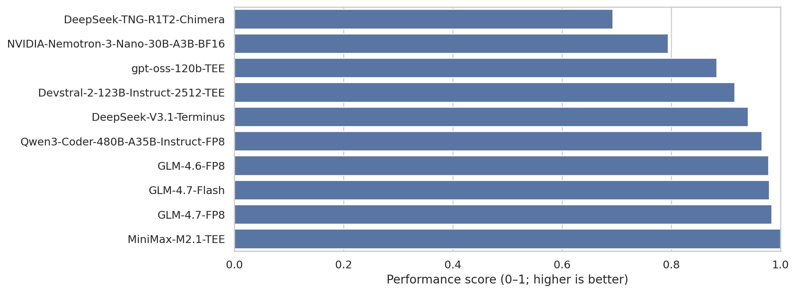

Robustness variants (secondary) include: (i) an overall aggregation that averages all `(competition, budget)` settings equally, and (ii) a 1200s-only aggregation. See Appendix B.

### 3.3 Cross-competition consistency

Per-competition ranks are computed in the same normalized space as the primary aggregate leaderboard (best budget per competition). The heatmap below shows each model’s rank (1=best) per competition.

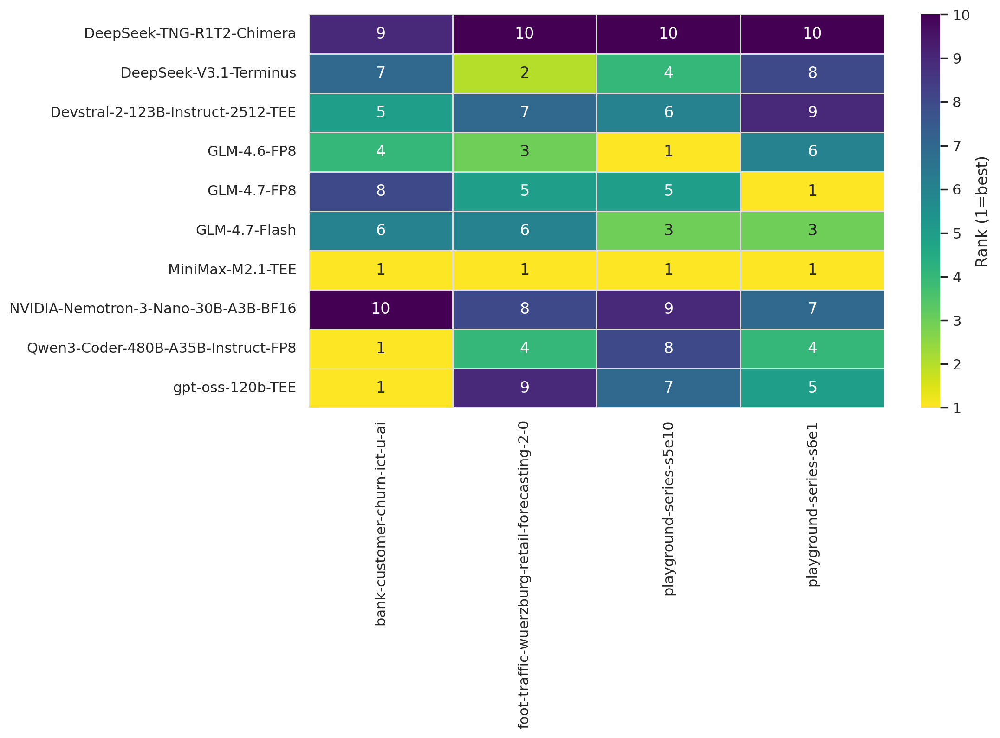

Rank variability across competitions is summarized via rank standard deviation (lower is more consistent). See Appendix C.

### 3.4 Reliability and stability

Reliability has two components:
1. The first component is run success rate, which measures how often a run yields a valid score.
2. The second component is within-setting stability, which measures how variable a model is across the five runs used for each reported setting.

The trade-off is summarized via a Pareto-style plot (performance vs stability; color indicates success rate).

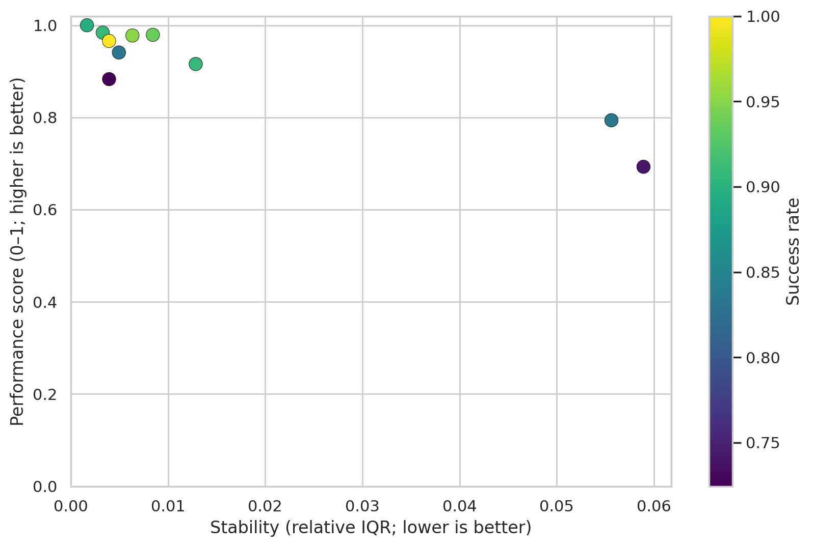

Supporting breakdown plots for success rate and stability are included in Appendix D.

### 3.5 Scaling with time budget

Normalized performance is analyzed as time budget increases from 240s to 600s to 1200s, averaged across the four competitions.

On aggregate, scaling is broadly consistent with the expected monotonic pattern. Define a model’s per-competition scaling curve as **monotone** if its direction-corrected five-run medians do not worsen as budget increases (240s → 600s → 1200s). Under this definition:
- Across all `40` model×competition curves (10 models × 4 competitions), `23/40 = 57.5%` of curves are monotone.
- Across the 10 models, the median model is monotone in `62.5%` of competitions.

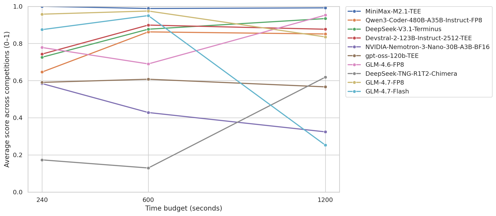

At the individual model level, scaling can be noisy. Each task×budget setting is summarized by five successful runs. More runs are likely required for stable model-level scaling curves. Appendix E reports marginal gains and monotonicity rates.

### 3.6 Per-competition highlights

This subsection highlights a small number of representative task/budget settings. Full five-run tables are available in the companion repository materials.

#### bank-customer-churn-ict-u-ai (AUC; higher is better)

The strongest median AUC at 1200s is `0.928000` (GPT OSS 120B TEE).

At 240s, the top median is `0.926671` (MiniMax-M2.1-TEE).

This task shows top-tier clustering in the `0.92x` range, with notable underperformance from some models in specific settings (for example, NVIDIA-Nemotron-3-Nano at `0.813105` at 1200s).

#### foot-traffic-wuerzburg-retail-forecasting-2-0 (RMSE; lower is better)

MiniMax-M2.1-TEE is best at all three budgets (`0.066846`, `0.065770`, `0.065489`).

A key instability signal appears for GLM 4.7 Flash at 1200s: median `0.107502` with IQR `0.070186..0.221725`. This IQR is substantially wider than neighboring models.

#### playground-series-s5e10 (RMSE; lower is better)

At 1200s, medians are tightly clustered near `0.0562`, with the best setting at `0.056190` (GLM-4.6-FP8) and many models within a few `1e-4`.

#### playground-series-s6e1 (RMSE; lower is better)

MiniMax-M2.1-TEE leads at 1200s with RMSE `8.699779`.

At 600s, TNG-R1T2-Chimera has a large failure-mode outlier (median `10.199380`, IQR `9.088197..13.444163`). This motivates caution when interpreting single-budget standings.

## 4. Stability notes

The stability companion should be read jointly with median performance. Several settings show narrow IQRs, while others exhibit broad or asymmetric spread.

Examples of high-variance settings include:
- NVIDIA-Nemotron-3-Nano on s6e1 at 240s: `9.054929 (9.043837..10.604385)`
- DeepSeek-V3.1-Terminus on foot-traffic at 600s: `0.068627 (0.066899..0.166052)`

## 5. Limitations

This paper reports results for 10 models with complete coverage under the paper’s evaluation grid.

### 5.1 Token accounting

Token consumption is currently unavailable in the run logs used for this paper (only `max_tokens` configuration is present). Token efficiency is deferred to a later revision after token and cost instrumentation is added.

### 5.2 Budget scaling and run count

Two constraints matter when interpreting scaling with time budget. First, budgets are coupled to instruction sets (the 1200s setting uses an XGBoost-focused instruction set), so scaling reflects both more time and different instructions. Second, each reported setting is based on five successful runs, which is enough to show aggregate patterns but can be noisy at the individual model level.

## 6. Reproducibility materials

This paper is accompanied by a repository that contains run logs, scripts to regenerate figures and tables from those logs, and validation steps to confirm coverage.

## References

1. Kilo Code (website). https://www.kilocode.app/ (accessed 2026-02-14).  
2. Kilo Code documentation. https://kilo.ai/docs (accessed 2026-02-14).  
3. Kilo Code GitHub organization. https://github.com/Kilo-Org (accessed 2026-02-14).  
4. OpenRouter rankings (“Top Apps”, weekly tokens, opt-in tracking). https://openrouter.ai/rankings (accessed 2026-02-14).  
5. OpenRouter documentation: App attribution and rankings. https://openrouter.ai/docs/app-attribution (accessed 2026-02-14).  
6. Chen, T., and Guestrin, C. XGBoost: A Scalable Tree Boosting System. KDD 2016. https://doi.org/10.1145/2939672.2939785  
7. Jimenez, C., Yang, J., Wettig, A., et al. SWE-bench: Can Language Models Resolve Real-World GitHub Issues? (2023). https://arxiv.org/abs/2310.06770

## Appendix A. Models evaluated in this paper

This appendix lists the models included in the 10-model set evaluated in this paper and summarizes metadata that is useful for interpretation. Public release dates, parameter counts, and license fields are taken from public model cards and announcements, as cited below.

The following notes apply to Appendix A:
- “Type” describes the availability implied by the source (open weights, or API-served). If the source does not clearly specify a release or license, the entry is marked as unknown.
- “Params” are taken from the source when available. In several cases, the benchmark uses provider-specific identifiers that do not include a public parameter count.

| Model ID (as used in runs) | Provider (in runs) | Type | Params | Public date (source) | License (source) | Sources |
|---|---|---|---|---|---|---|
| `Qwen/Qwen3-Coder-480B-A35B-Instruct-FP8` | `chutes` | open weights | 480B total, 35B active | 2025-07-23 | Apache-2.0 | S2 |
| `openai/gpt-oss-120b-TEE` | `chutes` | open weights | 120B | 2025-08-05 | Apache-2.0 | S1 |
| `zai-org/GLM-4.7-FP8` | `chutes` | open weights | unknown | 2025-12-22 | MIT | S3, S4 |
| `zai-org/GLM-4.7-Flash` | `chutes` | open weights | unknown | 2025-12-22 | MIT | S3, S4 |
| `MiniMaxAI/MiniMax-M2.1-TEE` | `chutes` | API-served (weights unknown) | unknown | 2025-12-23 | unknown | S6 |
| `zai-org/GLM-4.6-FP8` | `chutes` | open weights | unknown | 2025-09-30 | MIT | S3, S5 |
| `deepseek-ai/DeepSeek-V3.1-Terminus` | `chutes` | API-served (weights unknown) | unknown | 2025-09-23 | unknown | S10 |
| `nvidia/NVIDIA-Nemotron-3-Nano-30B-A3B-BF16` | `chutes` | open weights | 30B total, 3B active | 2025-12-15 | NVIDIA Nemotron Open Model License Agreement | S7, S12 |
| `mistralai/Devstral-2-123B-Instruct-2512-TEE` | `chutes` | open weights | 125B | 2025-12-09 | Modified MIT | S8, S11 |
| `tngtech/DeepSeek-TNG-R1T2-Chimera` | `chutes` | open weights | 671B | 2025-07-02 | unknown | S9 |

The sources for Appendix A are as follows:
- S1: https://openai.com/index/introducing-gpt-oss/
- S2: https://huggingface.co/Qwen/Qwen3-Coder-480B-A35B-Instruct
- S3: https://docs.bigmodel.cn/en/guide/releaseNote/new
- S4: https://huggingface.co/zai-org/GLM-4.7
- S5: https://huggingface.co/zai-org/GLM-4.6
- S6: https://www.minimaxi.com/en/news/minimax-m2.1
- S7: https://research.nvidia.com/labs/adlr/Nemotron-3/
- S8: https://mistral.ai/terms/model-lifecycle/
- S9: https://huggingface.co/tngtech/DeepSeek-TNG-R1T2-Chimera
- S10: https://technode.com/2025/09/23/deepseek-releases-v3-1-terminus-enhanced-reasoning-in-top-version/
- S11: https://huggingface.co/mistralai/Devstral-2-123B-Instruct-2512
- S12: https://huggingface.co/nvidia/NVIDIA-Nemotron-3-Nano-30B-A3B-Base-BF16

## Appendix B. Aggregate leaderboard robustness checks

This appendix reports two alternative aggregations of the main leaderboard. These variants are included as sensitivity checks.

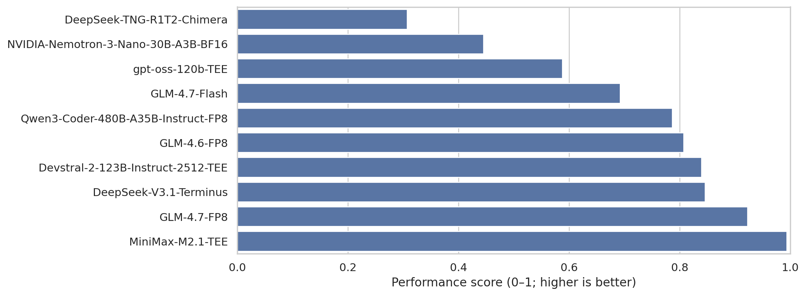

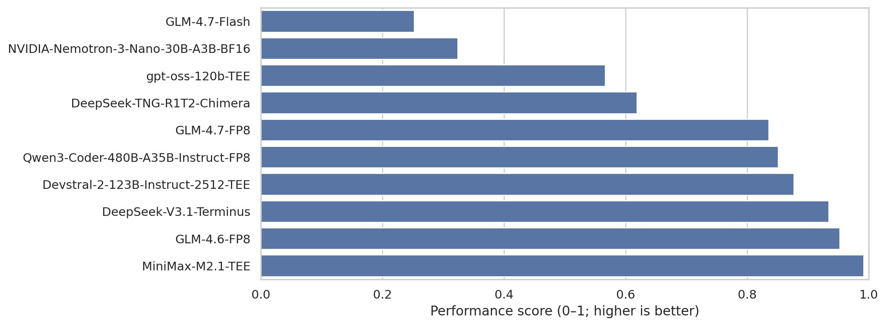

## Appendix C. Additional consistency view

Rank variability across competitions is summarized via rank standard deviation (lower indicates higher consistency).

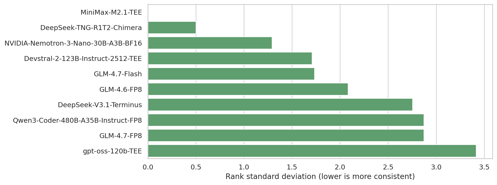

## Appendix D. Additional reliability and stability views

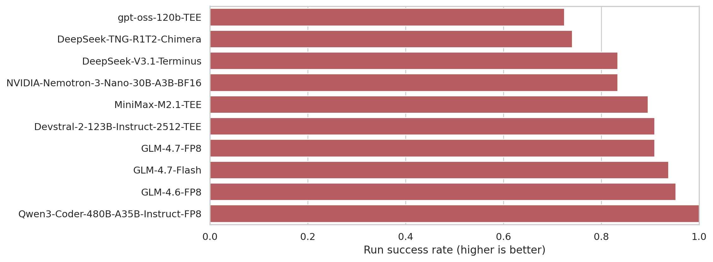

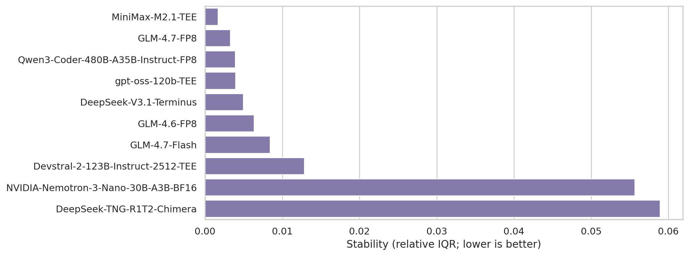

## Appendix E. Additional scaling views

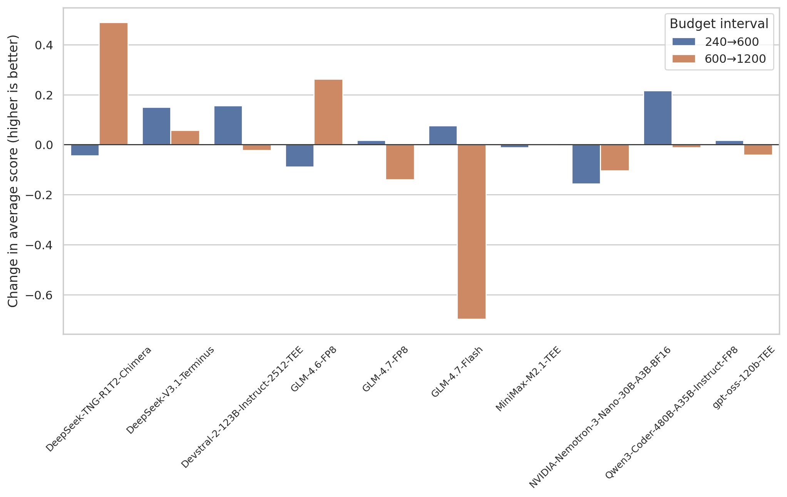

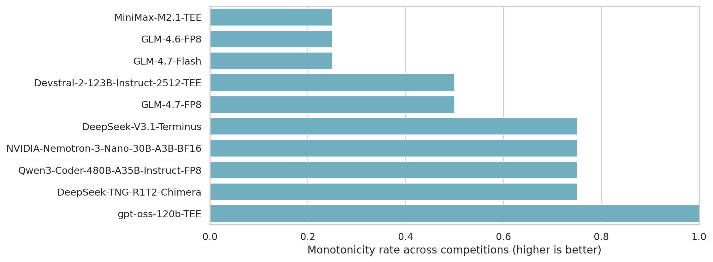

## Appendix F. Scoring, aggregation, and normalization details

This appendix defines how scores are computed and how the aggregate leaderboard is constructed.

### F.1 Per-run scoring

- Each run produces a submission file.
- The harness validates the submission schema against the competition’s expected format.
- The submission is scored on a private holdout set outside the agent workspace to produce `score_raw` using the competition’s metric (for example, AUC or RMSE).

### F.2 Per-setting aggregation

This paper aggregates results for each `(competition, model, budget)` setting as follows:
- Consider the earliest five successful runs.
- Report the median of their `score_raw`.

### F.3 Min-max normalization

Raw metrics are not directly comparable across competitions because they have different scales and directions. To build a single aggregate leaderboard, this paper uses within-setting min-max normalization:

This paper defines the normalized score within each `(competition, budget)` setting as follows:
1. Convert to a “higher is better” value:
   - `value_for_rank = score_raw` for higher-is-better metrics.
   - `value_for_rank = -score_raw` for lower-is-better metrics.
2. Min-max normalize within the setting so that the best model receives `1.0` and the worst receives `0.0`:
   - `score = (value_for_rank - min(value_for_rank)) / (max(value_for_rank) - min(value_for_rank))`.

### F.4 Primary aggregation

The primary aggregation is “best budget per competition”:
- For each `(model, competition)`, take the maximum normalized score across the three budgets.
- Average across the four competitions with equal weights.

### F.5 Rank-based normalization (supplementary)

For comparison, this appendix includes an alternative rank-based normalization that maps models to evenly spaced scores within each setting based on rank. This approach preserves ordering but discards absolute metric gaps within a `(competition, budget)` setting.

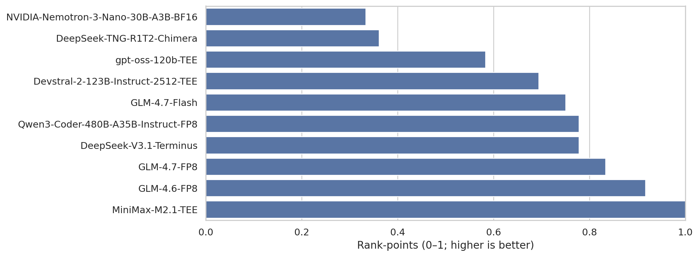

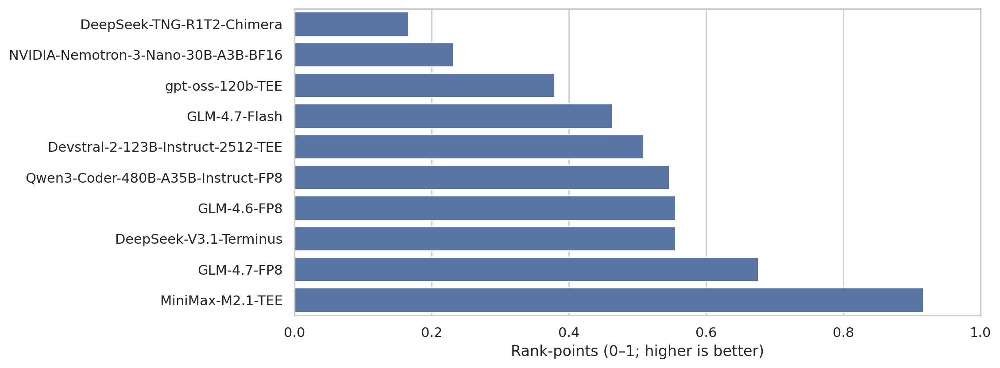

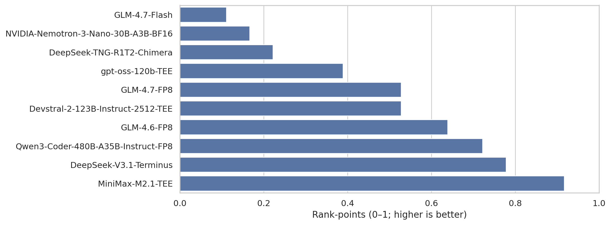

## Appendix G. Harness details (Kilo Code)

This appendix explains what Kilo Code is and why it is used as the single agent harness in this paper.

### G.1 What Kilo Code is

Kilo Code is an AI coding agent for VS Code. In TML-bench, it is used as the uniform interface between a model and the benchmark task workspace: the agent reads task files, writes code, trains models, and produces a submission file.

Kilo Code is also widely used in practice. For example, OpenRouter’s public “Top Apps” leaderboard (weekly tokens, based on opt-in app attribution) lists Kilo Code as #2 as of 2026-02-14, and as the highest-usage VS Code coding agent app in that list (ahead of other coding-agent apps such as Cline and Roo Code) [4, 5]. This is a point-in-time snapshot; rankings vary over time.

### G.2 Why standardize on a single harness

Many open-source agent harnesses exist, and different harnesses can introduce confounds: differences in tool availability, file access conventions, patch/apply mechanics, retry behavior, and failure handling. This paper standardizes on a single harness to reduce “harness effects” and to make comparisons across models more interpretable.

Kilo Code was chosen for three practical reasons:
1. Kilo Code is reliable, and it is mature enough to run repeatedly under timeouts and produce stable artifacts.
2. Kilo Code is used with a wide range of open and API-served models, which reduces the risk of harness-model incompatibilities.
3. Kilo Code enables fast sanity checks, because it is available as a VS Code extension and basic end-to-end behavior can be verified quickly outside benchmark runs.

### G.3 What the harness enforces (high level)

At a high level, the harness ensures that:
- The agent works in a clean per-run workspace with only the agent-visible task inputs.
- The agent stage is time-bounded (240s/600s/1200s).
- Submissions are validated and normalized before scoring.
- The final score is computed on hidden holdout labels outside the agent workspace.

### G.4 Limitations of this choice

Standardizing on Kilo Code improves comparability, but it also narrows the scope of conclusions: results are about models *as used through this harness* under this protocol. Other harnesses may yield different absolute performance or failure rates.

## Appendix H. Operational lessons for building agent benchmarks

Running TML-bench reliably surfaced several operational lessons that may be useful to teams building similar evaluation systems.

### H.1 A control plane beats ad-hoc scripts

Long-running suites benefit from a simple “control plane”: durable run IDs, structured logs, and machine-readable events. This makes suites resumable, debuggable, and auditable. In contrast, ad-hoc shell scripts tend to fail silently, make partial failures hard to diagnose, and are difficult to parallelize safely.

### H.2 Circuit breakers save time and money

When a provider or model enters a failure streak (timeouts, repeated invalid submissions, intermittent API errors), a circuit breaker can pause or skip that lane. This prevents burning compute and wall-clock on a run that is likely to fail again and allows the suite to make progress elsewhere.

### H.3 Incremental persistence prevents “lost suites”

Suites that take hours or days should write results continuously. Persisting every run outcome (including failures) as soon as it completes makes the overall process robust to interruptions: machine restarts, parent process crashes, or transient provider outages. It also supports incremental analysis rather than “all-or-nothing” end-of-suite reporting.

### H.4 Per-task resource caps improve stability

Some tasks are more resource-sensitive than others (for example, heavy preprocessing, large feature matrices, or memory pressure under parallelism). Per-task caps (concurrency limits, memory limits, or stricter runtime limits) can prevent cascading failures and make the benchmark safer to run repeatedly.

### H.5 Post-run diagnostics are part of reliability

A benchmark should treat “why did this run fail?” as a first-class output. Capturing a compact post-run diagnostic artifact (status, timeout vs validation vs runtime error, and a short trace or log pointer) turns failures into actionable debugging items and improves reproducibility of observed failure modes.
